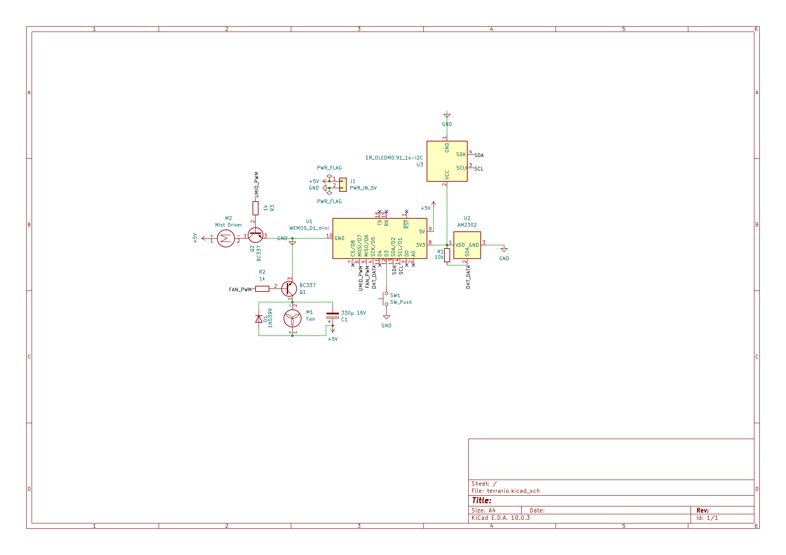

# 🦎 Terrário BCC — Controlador ESP8266

Controlador de terrário para **Boa constrictor constrictor** baseado em NodeMCU ESP8266, com monitoramento de temperatura e umidade, controle de exaustora, umidificador e lâmpada cerâmica via Tasmota.

---

## Estrutura do projeto

```
Terrario/
├── platformio.ini
└── src/
    ├── main.cpp            # setup() e loop()
    ├── config.h / .cpp     # defines de pinos, constantes e estado global
    ├── eeprom_storage.h/cpp# persistência de WiFi e IP Tasmota
    ├── tasmota.h / .cpp    # comunicação HTTP com o SA-01
    ├── control.h / .cpp    # lógica de controle (fan, umidificador, lâmpada)
    ├── display.h / .cpp    # OLED SSD1306 — 4 telas + ícones + animação PROGMEM
    └── web.h / .cpp        # servidor HTTP, dashboard e API JSON
```

---

## Hardware

| Componente | Modelo | Função |
|---|---|---|
| Microcontrolador | Wemos D1 Mini (ESP8266) | Controlador principal |
| Sensor | DHT22 (AM2302) | Temperatura + umidade |
| Display | OLED SSD1306 0.96" 128×64 I2C | Interface local |
| Transistor x2 | BC337-40 NPN | Chaveamento fan + umidificador |
| Interruptor inteligente | SA-01 (TYWE2S) + Tasmota | Controle lâmpada cerâmica 220V |
| Lâmpada | Cerâmica IR 100W | Aquecimento |
| Exaustora | Fan 40mm 5V (→ 120mm 12V no terrário definitivo) | Ventilação/umidade alta |
| Umidificador | Piezo ultrassônico 5V (TY-JS01) | Umidade baixa |
| Resistor x2 | 1kΩ | Base dos BC337 |
| Resistor | 10kΩ | Pull-up DATA DHT22 |
| Diodo x2 | 1N5399 | Flyback fan + umidificador |
| Capacitor | 330µF 16V | Filtro fan |
| Botão | Chave táctil | Navegação telas OLED |
| Fonte | 5V 2A USB | Alimentação geral |

---

## Diagrama de circuito



---

## Pinagem — D1 Mini

| Pino | Função |
|---|---|
| D1 (GPIO5) | SCL — OLED |
| D2 (GPIO4) | SDA — OLED |
| D3 (GPIO0) | Botão navegação (INPUT_PULLUP, LOW = pressionado) |
| D5 (GPIO14) | DHT22 DATA |
| D6 (GPIO12) | BC337 #1 — Exaustora |
| D7 (GPIO13) | BC337 #2 — Umidificador |

---

## Ligação BC337

```
GPIO ── R(1kΩ) ── Base (pino 2, centro)
                  Coletor (pino 1, esquerda) ── carga (-)
                  Emissor (pino 3, direita)  ── GND

Carga (+) ── 5V
Diodo 1N5399 em paralelo com a carga:
  Anodo  → coletor / carga (-)
  Catodo → 5V / carga (+)
```

> Parte plana do BC337 virada para você, pernas para baixo: **1=Coletor | 2=Base | 3=Emissor**

---

## Ligação OLED

| OLED | NodeMCU |
|---|---|
| VCC | 3.3V |
| GND | GND |
| SCL | D1 |
| SDA | D2 |

---

## Ligação DHT22

| DHT22 | NodeMCU |
|---|---|
| Pin 1 VCC | 3.3V |
| Pin 2 DATA | D5 + R(10kΩ) pull-up para 3.3V |
| Pin 3 | NC |
| Pin 4 GND | GND |

---

## SA-01 / Tasmota

O SA-01 (TYWE2S — ESP8285) foi reflashado com **Tasmota 15.4.0** via ESPLink + esptool.

Configuração Tasmota:
- Module type: **Generic (18)**
- GPIO12 → `Relay 1`
- GPIO13 → `Button 1`

O D1 Mini se comunica via HTTP local:
```
GET http://<ip>/cm?cmnd=Power%20ON
GET http://<ip>/cm?cmnd=Power%20OFF
GET http://<ip>/cm?cmnd=Power        ← poll de status
```

---

## Setpoints padrão

Baseados no **Manual de Criação — Animais Brasil 2023** para *Boa constrictor constrictor*:

| Parâmetro | Valor padrão | Descrição |
|---|---|---|
| `humMin` | 60% | Liga umidificador abaixo deste valor |
| `humMax` | 80% | Liga exaustora acima deste valor |
| `humHyst` | 5% | Histerese: umidif. desliga em >65%, exaust. desliga em <75% |
| `tempMin` | 24°C | Religa lâmpada se temperatura cair abaixo |
| `tempMax` | 32°C | Referência de conforto (manual: 24–32°C ambiente) |
| `tempCrit` | 36°C | Corta lâmpada acima deste valor (manual: superfície até 36°C) |

Todos os setpoints são configuráveis pela web interface em tempo real.

---

## Lógica de controle

### Umidificador
```
liga  se humidity < humMin
desliga se humidity > humMin + humHyst
```

### Exaustora
```
liga  se humidity > humMax
desliga se humidity < humMax - humHyst
```

### Lâmpada cerâmica (Tasmota)
```
desliga se temperature > tempCrit          ← emergência
liga    se temperature < tempMin           ← frio crítico (prioridade)
liga    se temperature < tempCrit - 2.0    ← histerese normal
```
Poll do status real a cada 15s. Correção automática se estado real ≠ desejado.

---

## EEPROM

| Offset | Tamanho | Conteúdo |
|---|---|---|
| 0 | 32 bytes | WiFi SSID |
| 32 | 64 bytes | WiFi senha |
| 96 | 16 bytes | IP do Tasmota |

---

## Display OLED — Telas

Navegação por botão táctil em D3. Indicador de tela: grade 2×2 de quadradinhos no canto superior direito (quadrado preenchido = tela ativa).

### Tela 0 — Status (padrão)
```
[🌡] 23.4C         ▣□
[💧] 80.5%         □□
[🌀]ON [〰]ON [🔥]OK
```

### Tela 1 — Setpoints
```
Tmin: 24.0C        □▣
Tmax: 32.0C        □□
Tcrit:36.0C   Lamp:
Hmin: 60%     desej:ON
Hmax: 80% +/-5 real:ON
```

### Tela 2 — Rede
```
[WiFi] WiFi        □□
SSID:              ▣□
MinhaRede
IP: 192.168.x.x
SA01: 192.168.100.87
```

### Tela 3 — Animação
Zona amarela (y 0–15): "Lucifer"
Zona azul (y 16–63): animação de 14 frames do spritesheet da cobra, atualizada a cada 250ms. Bitmaps convertidos em PROGMEM no `display.cpp`.

```
Lucifer            □□
                   □▣
  ╔═══════════╗
  ║  ~ cobra~ ║
  ╚═══════════╝
```

---

## Web Interface

Acesse `http://<ip_do_esp>` na mesma rede.

| Endpoint | Método | Descrição |
|---|---|---|
| `/` | GET | Dashboard com fetch automático a cada 5s |
| `/setpoints` | GET | Atualiza setpoints (sem recarregar página) |
| `/save` | POST | Salva WiFi + IP Tasmota na EEPROM |
| `/api` | GET | JSON com todos os valores |

### Exemplo `/api`
```json
{
  "temp": 27.3,
  "hum": 72.1,
  "fan": false,
  "humidifier": false,
  "lampOn": true,
  "lampShould": true,
  "tempMin": 24.0,
  "tempMax": 32.0,
  "tempCrit": 36.0,
  "humMin": 60,
  "humMax": 80,
  "humHyst": 5,
  "tasmotaIP": "192.168.100.87"
}
```

---

## Primeiro uso

1. Grave o firmware: `pio run --target upload`
2. Liga o D1 Mini — sobe AP `AP_Terrario_XXXX` com senha `Lucifer_YYYY` (XXXX = 4 primeiros hex do MAC, YYYY = 4 últimos hex do MAC)
3. Conecta no AP e acessa `http://192.168.4.1`
4. Preenche SSID, senha WiFi e IP do Tasmota
5. Após salvar reinicia e conecta na rede
6. O IP aparece no display OLED e no serial monitor
7. Acessa o dashboard pelo IP

---

## PlatformIO

```ini
[env:d1_mini]
platform  = espressif8266
board     = d1_mini
framework = arduino

monitor_speed = 115200

lib_deps =
    adafruit/DHT sensor library
    adafruit/Adafruit Unified Sensor
    adafruit/Adafruit GFX Library
    adafruit/Adafruit SSD1306
```

```bash
# compilar e gravar
pio run --target upload

# monitor serial
pio device monitor
```

---

## Roadmap

- [ ] Migrar umidificador piezo para controle direto via PWM 113kHz (bypass XMC8P53 OTP)
- [ ] Trocar fan 40mm 5V por 120mm 12V no terrário definitivo (compensado naval)
- [ ] Step-down 12V → 5V na subplaca do terrário definitivo
- [ ] Case impresso com caneta 3D sobre template A4
- [ ] Câmera IP (INO-IPC-V2.3 BK7252N) quando OpenBK7252N tiver suporte a câmera

---

## Licença

MIT — use à vontade.
